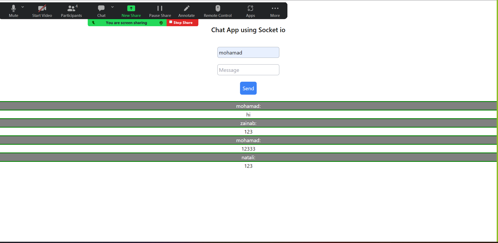

# Chat App using Socket.IO and Node.js

This is a simple chat application built using Socket.IO and Node.js.

## Technologies Used

Node.js
Express
Socket.IO
HTML
CSS (Tailwind CSS)

## Usage

Open your web browser and navigate to http://localhost:5000.

Enter your name and message in the input fields and click the "Send" button.

The message will be displayed in the message area, along with the sender's name.

## Who work on this lab

1. Zainab Malkwai
2. Natali Alkayed
3. Mohammad Al-Omari
4. Mohammad Shawabkeh

